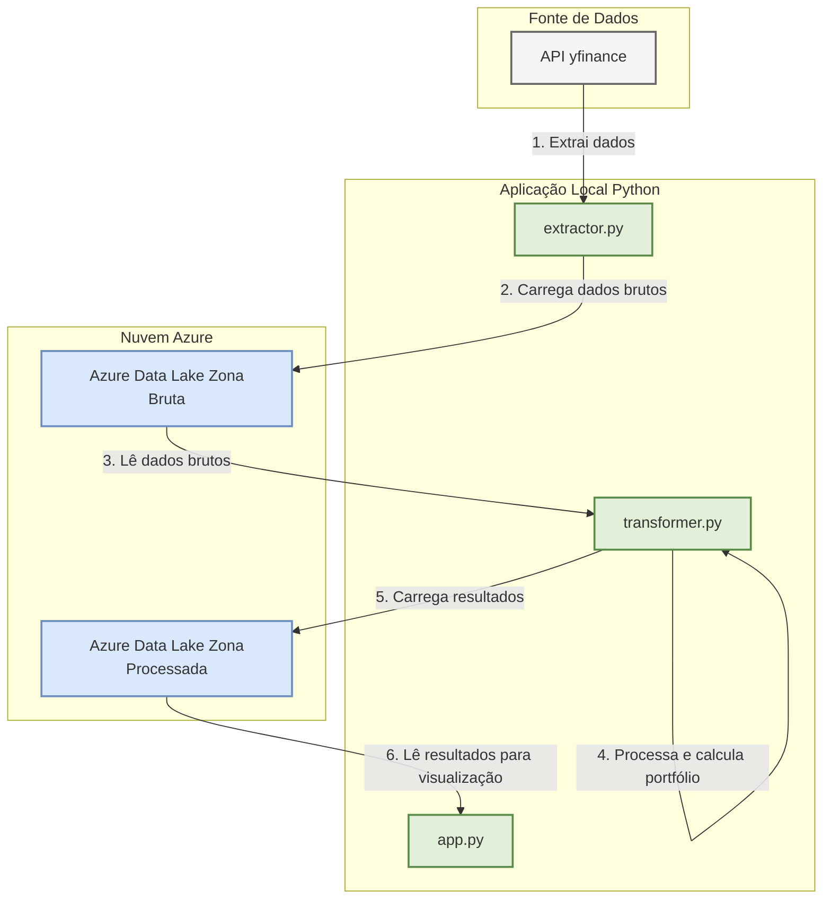

# ETL-markowitz: Otimização de Portfólio de Investimentos com Python e Azure


Este projeto é um pipeline de dados completo (ETL/ELT) que extrai dados históricos do mercado de ações, calcula a alocação de portfólio ótima com base na Teoria Moderna de Portfólio de Markowitz e apresenta os resultados em um dashboard web interativo.

## 🏛️ Arquitetura do Projeto

O fluxo de dados foi desenhado para ser modular e escalável, utilizando serviços da nuvem Azure para armazenamento e uma aplicação local para orquestração, processamento e visualização.



## 🛠️ Tecnologias Utilizadas

* **Linguagem:** Python 3.10
* **Gerenciamento de Dependências:** Poetry
* **Análise de Dados:** Pandas, NumPy
* **Fonte de Dados:** yfinance API
* **Otimização de Portfólio:** PyPortfolioOpt
* **Armazenamento na Nuvem:** Azure Data Lake Storage Gen2
* **Dashboard Interativo:** Streamlit
* **Visualização de Dados:** Plotly Express

## 📂 Estrutura do Projeto

```
ETL-markowitz/
├── src/
│   └── etl_markowitz/
│       ├── __init__.py           # Torna a pasta um "pacote" Python, permitindo importações
│       ├── azure_connector.py    # Funções para upload e download do Azure Data Lake
│       ├── extractor.py          # Lógica de extração de dados da API yfinance
│       ├── settings.py           # Arquivo central de configurações (tickers, datas, nomes de containers)
│       └── transformer.py        # Lógica de transformação e otimização de portfólio (Markowitz)
├── tests/                        # Pasta para futuros testes unitários do projeto
├── .env                          # Arquivo local com as credenciais do Azure (NÃO DEVE IR PARA O GITHUB)
├── .gitignore                    # Define quais arquivos e pastas o Git não deve versionar
├── app.py                        # Aplicação principal do dashboard Streamlit (Visualização)
├── poetry.lock                   # Versões exatas de todas as dependências (gerenciado pelo Poetry)
├── pyproject.toml                # Configuração do projeto e dependências principais (gerenciado pelo Poetry)
└── README.md                     # Documentação do projeto
```

## 🚀 Como Executar o Projeto Localmente

**Pré-requisitos:**
* Python 3.10+
* Poetry instalado
* Uma conta no Microsoft Azure com um Data Lake Storage Gen2 configurado

**Passos:**

1.  **Clone o repositório:**
    ```bash
    git clone [https://github.com/seu-usuario/ETL-markowitz.git](https://github.com/seu-usuario/ETL-markowitz.git)
    cd ETL-markowitz
    ```

2.  **Instale as dependências:**
    ```bash
    poetry install
    ```

3.  **Configure suas credenciais:**
    * Crie um arquivo chamado `.env` na raiz do projeto.
    * Dentro dele, adicione a sua Connection String do Azure:
        ```env
        AZURE_STORAGE_CONNECTION_STRING="SuaConnectionstringCompletaAqui"
        ```

4.  **Execute o pipeline de ETL:**
    * Primeiro, execute o script de extração para buscar os dados da API e salvá-los na Zona Bruta do Data Lake.
        ```bash
        poetry run python src/etl_markowitz/extractor.py
        ```
    * Em seguida, execute o script de transformação para ler os dados brutos, calcular o portfólio e salvar os resultados na Zona Processada.
        ```bash
        poetry run python src/etl_markowitz/transformer.py
        ```

5.  **Inicie o Dashboard:**
    * Com os dados processados na nuvem, inicie a aplicação Streamlit.
        ```bash
        poetry run streamlit run app.py
        ```
    * Seu navegador abrirá automaticamente no endereço do dashboard.

## 📊 Resultado Final

O projeto resulta em um dashboard web interativo que apresenta a alocação de ativos recomendada para maximizar o retorno ajustado ao risco, juntamente com as métricas de performance esperadas para este portfólio.


